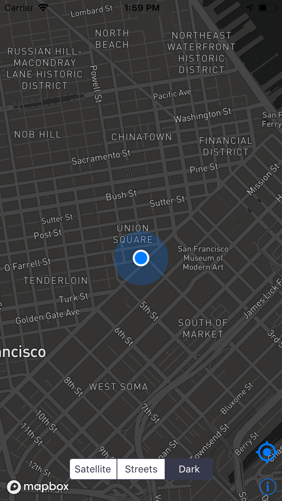
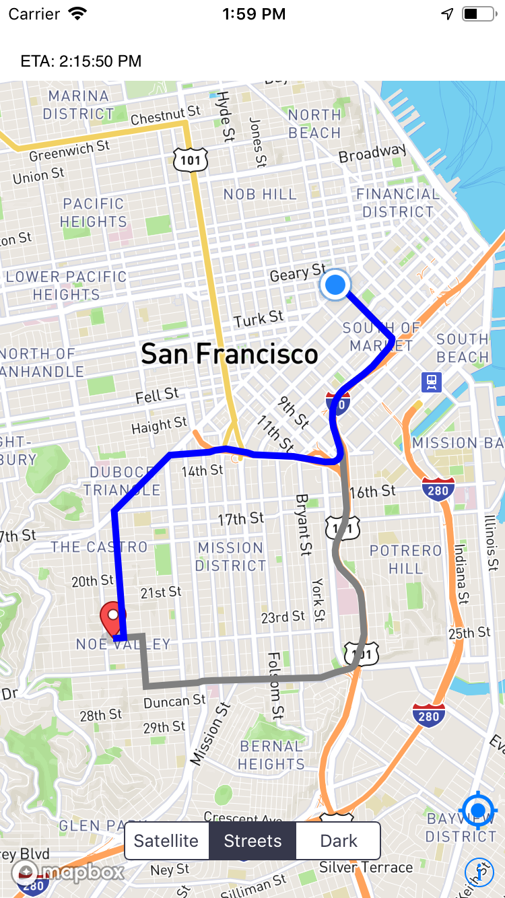

# Route Viewer
This is a route viewer app that shows user's current location on the map. Upon long pressing on any location on the map, it will show the route from user's location to the selected location. Also, user can select different style of map from the home screen.

<p align="middle">
 
</p>


The project uses **Mapbox** SDK for showing the map and route. Also, for dependency management **Cocoapods** have been used.

After cloning the repository, go to the project directory and run the following command from command line.
```
pod install
```

After that you need to setup Mapbox iOS SDK. To do that follow the steps described in the link below.
* [Integrate the Mapbox Maps SDK for iOS into your application](https://www.mapbox.com/install/ios/).